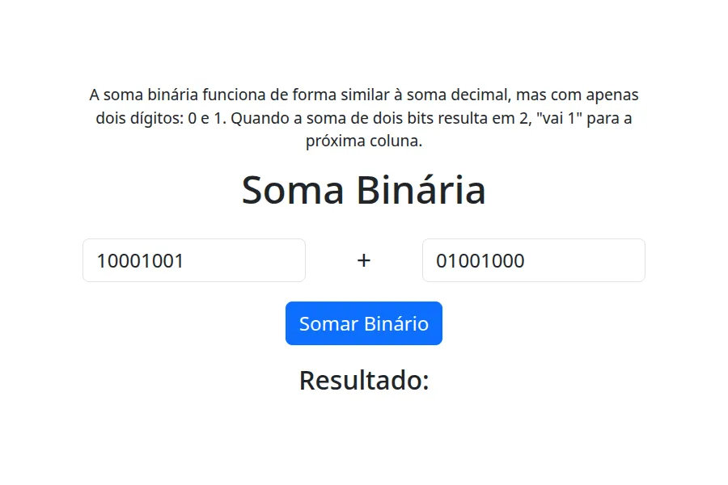

# Soma Binária

|Screenshot|
|---|
||

## Descrição

Este projeto é uma aplicação web que permite somar dois números binários. A aplicação foi desenvolvida utilizando HTML, CSS, Bootstrap 5 e Alpine.js.

A soma binária funciona de forma similar à soma decimal, mas com apenas dois dígitos: 0 e 1. Quando a soma de dois bits resulta em 2, "vai 1" para a próxima coluna

## Como usar

1.  Abra o arquivo `index.html` em seu navegador.
2.  Insira dois números binários nos campos de entrada.
3.  Clique no botão "Somar Binário".
4.  O resultado da soma será exibido abaixo do botão.

